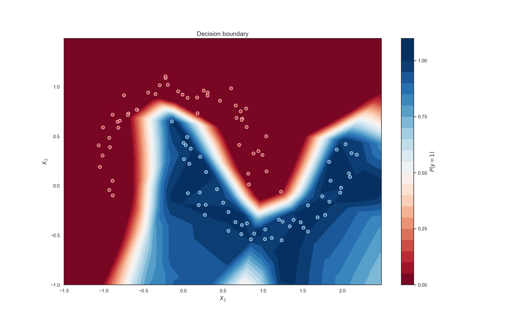

# Requirements
- Visual C++20
- CUDA Toolkit
- Probably any RTX GPU (we used RTX 2070m)

# make moons dataset training test
```C++
neural_network model(
    linear(2, 32),
    relu(),
    linear(32, 24),
    relu(),
    linear(24, 1),
    relu()
);

// allocating matrices on cuda
matrix in = inputs; 
matrix out = labels;

auto progress = [=](size_t i, value_type loss, value_type)->void {
    cout << "[" << i << "] loss: " << std::setprecision(8) << loss << endl;
};
logger log(1000, progress);
	
hyperparameters<adam> params = {
    .learning_rate = 0.001,
    .beta1 = 0.9,
    .beta2 = 0.999,
};

adam optimizer(model.linear_count, params);

// <mse> loss function, epochs, inputs, targets, optimizer, logger object
model.train<mse>(4001, in, out, optimizer, log);
```
Using model above we've managed to get quite good result

